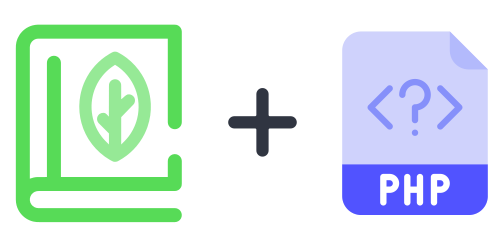

# Sage.php

  

The PHP reference implementation for **[Sage](https://libre.dorkodu.com/sage)**, a query-based data exchange protocol for APIs, created at [Dorkodu](https://dorkodu.com).

See the documentation at **[/docs](./docs)**.

## Getting Started

A general overview of Sage is available on the [website](https://libre.dorkodu.com/sage). That overview describes a simple set of Sage examples that exist as [tests](src/tests) in this repository. A good way to get started with Sage is the [official documentation](https://libre.dorkodu.com/sage/learn).

### Installation

— Work in progress.

## Contributing

We welcome your contributions, even if it is a simple idea.

Learn how to [contribute](./.github/CONTRIBUTING.md).

## Author

Doruk Eray — [GitHub](https://github.com/dorukeray) **·** [Twitter](https://twitter.com/doruk4ever) **·** [doruk@dorkodu.com](mailto:doruk@dorkodu.com) **·** [doruk.dorkodu.com](https://doruk.dorkodu.com)

See also some of our [contributions](https://libre.dorkodu.com) that we are making at [Dorkodu](https://dorkodu.com) to the open source software community.

## License

Sage.php is open-sourced software licensed under the [MIT license](LICENSE).
